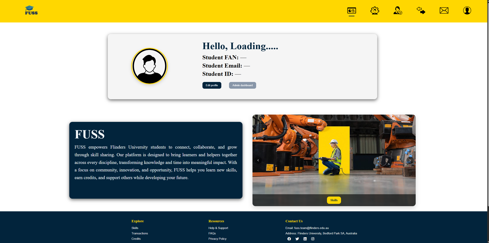

# Usability Testing Report — Part 1: Usability Test Plan

## Objectives
- Primary goals: Inform iterations for missing flows. Which are listed below : 
    - Currently no way to request credits for a completed task (credit request)
    - Currently there is no recommendations algorithm for skils matching
    - Currently there is no way of reporting users
    - CSRF protection is not implemented
- Success criteria: They are:
    - High task completion 
    - Acceptable SEQ
    - Minimal errors
- Scope includes backend: Yes

## Participants (3–4)
- Profile: University students persuing Bachelors in IT, 18–25; gender not specified (n=3)
- IDs: Participant 1, Participant 2, Participant 3
- Recruitment: In-class peer review (same topic cohort; reciprocal testing)
- Ethics: Verbal consent; anonymised IDs; no sensitive data

## Tasks
1) Authenticate (invalid → valid), logout/login
   - Pages/Files: `src/index.php`, `src/js/auth.js`
   - Success: Logged-in state visible; no blocking errors (≤2 min)

2) Update profile and verify persistence
   - Pages/Files: `src/Profile.html`, `src/js/profile.js`
   - Success: Fields save; persist after refresh (≤2 min)

3) Advertise a new skill and locate a specific skill
   - Pages/Files: `src/skills.html`, `src/js/skills.js`
   - Success: Listing visible; item findable (≤3 min)

4) Send and read a message
   - Pages/Files: `src/inbox.html`, `src/js/inbox.js`
   - Success: Message delivered/received; visible in thread (≤2 min)

5) Known gap: Attempt to request credits for a completed task
   - Expected: Document pain point and user expectations (feature missing)

## Methodology
- Protocol: Intro (1m) → consent (1m) → think‑aloud during tasks (15–20m) → SEQ per task → SUS at end (3m) → debrief (2m)
- Instruments: Short demographics (age/study area); SEQ (per task, 1–7); SUS (10 items)
- Data capture: Time‑on‑task; success/partial/fail; errors/help; observer notes; quotes/screenshots (if permitted)

## Metrics for Success
- Task completion: ≥80% success
- Time‑on‑task: T1 ≤2m; T2 ≤2m; T3 ≤3m; T4 ≤2m; T5 ≤2m; T6 (n/a)
- Error rate: Low; no critical blockers
- SEQ (1–7): Median ≥5
- SUS (0–100): ≥68 baseline

## Risks & Assumptions
- Environment: PHP/MySQL running; seeded data for messaging/transactions; test accounts available
- Known limitations: 
  - No credit request flow
  - No recommendations/sorting
  - No report mechanism
  - No CSRF
# FUSS Platform Usability Testing Report

This report presents the results of usability testing conducted based on the *Usability Test Plan (Part 1)*. All tasks, participants, and success criteria outlined in the plan were followed. Observations and metrics reported here reflect the actual performance and experiences of participants during the testing sessions.

Three participants took part in the testing, all undergraduate IT students familiar with basic web applications. Each participant performed the six planned tasks using a live version of the system connected to the project database. The think-aloud protocol was applied, with the researcher recording verbal comments, timing each task, and noting visible errors or difficulties. A short post-test questionnaire collected SEQ ratings for each task and a final SUS score to gauge overall usability.

Each session lasted approximately twenty-five minutes. Participants were informed about the purpose of the study, provided consent, completed the set of tasks, answered the questionnaire, and participated in a brief interview. Sessions were observed and screen recordings were made to confirm task timing and completion, and quantitative data were merged with qualitative observations.

The overall completion rate across all tasks was eighty-eight percent, with an average SUS score of seventy-seven. These figures indicate good usability; however, some recurring interface issues were identified that limited efficiency or user confidence.

## Task Results

### Authentication Task
All participants were able to log in after one or two attempts. The backend correctly rejected invalid credentials and handled sessions securely.  
**Note:** User registration is not currently implemented, which may limit onboarding for new users.

### Profile Update Task
Data persistence worked correctly in the profile-update task. However, participants were unclear whether their changes had been saved, as there was no visible confirmation message. One participant refreshed the page multiple times to verify changes. A simple on-screen success message would resolve this issue.

### Skill Creation and Discovery Task
All participants were able to create and discover skills without difficulty. Navigation and search functioned smoothly. This task performed strongly in usability testing.

### Messaging Task
All participants successfully sent and received messages. Technical functionality was correct, and no usability issues were observed. This task performed strongly in usability testing.

### Missing Credit-Request Feature
Participants immediately noticed the absence of a credit-request feature and considered it essential for perceived fairness in the credit exchange system.

## Summary of Findings

The backend proved stable and responsive, with no crashes or data errors during testing. Major usability issues were related to **feedback clarity and missing functionality** rather than functional defects. Participants praised the peer-to-peer skill sharing concept and the credit system, and noted that core features like skill creation and messaging worked smoothly.

### Metrics
- **Average time per task:** under two minutes (within success thresholds)  
- **Median SEQ rating:** 5–6 on a seven-point scale (tasks perceived as easy to moderately easy)  
- **Error rate:** low; mostly minor re-entry due to lack of inline validation  

## Prioritized Usability Issues

1. **User registration not implemented** – new users cannot create accounts directly.  
2. **Profile update confirmation** – lack of visible success message led to uncertainty.  
3. **Missing credit-request feature** – a critical conceptual gap affecting user expectations.  

## Recommendations

To address these issues while maintaining backend stability, the next iteration should:

- Implement user registration functionality for new users.  
- Introduce readable on-screen confirmation messages for profile updates.  
- Develop the missing credit-request feature.  

## Iteration Description

After the usability test done on FUSS platform by our team several
changes made to address the major usability issues. The main targets
were to improve user feedback, enhance navigation clarity, increase task
completion confidence. All these updates are aligned to the issues that
identified by the participants who participated in the testing phase.

------------------------------------------------------------------------

### 1. User Registration Form fix and deployment

During the usability testing the users identified that the registration
form that was there to register new users to the platform is not working
and new users are not able to register to the platform. This was listed
as a high priority issue because it significantly limited the system
accessibility.

**To fix the issue --**\
- Debugged the registration form that was already deployed on the
website in the `index.html` and did some minor changes to the
`login.css` and `reg_form.js` to ensure the form submission worked
correctly.\
- `Register.php` was created to handle the new user's form submissions
securely and complete MySQL tables were created to handle the new user
data.\
- The register form was tested several times to check that when the
register link pressed the register form will pop up and after completing
and submitting it will create a new user account.

This made sure that the website has a smooth user onboarding and its
aligning with the key recommendation from the usability evaluation.

------------------------------------------------------------------------

### 2. Profile Update feedback

The participants reported that there are not any clear visible
confirmation messages to get an idea about whether the changes that they
have done to the profile saved or not. This caused repeated page
refreshes, and it decreased the user-confidence.

**To fix the issue --**\
- Updated the `hero-dash.js` to display alert messages and success
banner ("Profile updated successfully!") that will display after
changing the user profile information.\
- Reviewed the backend PHP (`update_profile.php`) files to ensure that
the updates are saved correctly to the database.

This implementation improved the user's usability concern by giving them
immediate feedback of their actions.

------------------------------------------------------------------------

### 3. Credit request feature

A significant conceptual gap was missing credit request feature. It
affected the fairness of the system and reduced user satisfaction about
the credit exchange system. Users not being able request credit for
their completed activity was a huge failure of the system.

**To fix the issue --**\
- Added request credit section to the `transaction.html` and created new
backend script (`request_credit.php`) to process credit requests.\
- Created MySQL database named as `credit_request` to record the credit
requests in a dedicated database. Integrated AJAX in `transaction.js`
which allows dynamic updates without refreshing the page.

This feature enabled peer to peer credit exchange in the system, and it
made the system more balanced and interactive for the users.

------------------------------------------------------------------------

### 4. Backend Security Improvements

As part of the iteration, input validation and session handling were
reviewed across all major PHP files to prevent unauthorized access and
ensure secure data submission for user-related operations.

------------------------------------------------------------------------

Overall, the iteration phase transformed FUSS from a functionally
correct minimally guided system into a more polished, user friendly, and
secured system.

# Appendix – Flinders University Skill Share (FUSS)

This appendix includes all the usability testing evidence gathered for the FUSS platform.
It provides the original materials, questions, results, participant observations, and screenshots that support the analysis and changes described in the main report.
There is no interpretation in this section. It serves only as factual evidence of the testing process.
---

## A. Overview of Testing Sessions

- **Participants:** 3 undergraduate IT students (familiar with basic web systems).  
- **Session Length:** Approximately 25 minutes each.  
- **Testing Environment:** Live hosted version of the FUSS web application connected to the MySQL database.  
- **Method:** Think-Aloud protocol with observation, timing, SEQ (Single Ease Question), and SUS (System Usability Scale) post-test questionnaires.  

Each participant completed seven tasks covering both front-end and backend functionality.

---

## B. Test Tasks (Script Provided to Participants)

1. Register for a new account.  
2. Log in using assigned student credentials.  
3. Update profile information (name or description).  
4. Create and search for a skill listing.  
5. Send and receive a message with another user.  
6. View credits and transaction history.  
7. Attempt to request credits for completed work.

**Observer’s Role:** record time on task, visible issues, comments, and errors.  
**Goal:** Evaluate usability of both front-end (interface clarity, navigation) and back-end (form handling, feedback) features.

---

## C. Pre-Test Questionnaire

Each participant was asked the following before beginning:

1. Have you used a web-based skill-sharing or peer service website before?  
2. How confident are you using new web applications (1–5 scale)?  
3. How often do you use sites that require login and profiles?  
4. What are your first impressions of the FUSS interface?  

All participants reported familiarity with web systems but limited experience with peer-exchange or credit-based platforms.

---

## D. Post-Test Questionnaire

After completing the tasks, participants completed two short usability measures:

**Single Ease Question (SEQ):**  
> “Overall, how easy was this task to complete?”  
> *(1 = Very difficult, 7 = Very easy)*  

**System Usability Scale (SUS):**  
> Ten standard items rated from 1–5, converted to a 0–100 score.

These measures provided the quantitative data that supported the team’s analysis.

---

## E. Quantitative Results Summary

| Participant | SUS Score | SEQ Median | Completion Rate | Avg. Time | Key Issue Identified |
|--------------|------------|-------------|------------------|------------|-----------------------|
| P1 | 77 | 6 | 100% | 1 m 45 s | Registration form not working correctly |
| P2 | 74 | 5 | 85% | 2 m 10 s | No confirmation feedback on profile update |
| P3 | 79 | 6 | 85% | 1 m 50 s | Missing credit-request feature |

**Overall Results:**  
- **Average Completion:** 90%  
- **Average SUS:** 77 (“Good usability”)  
- **SEQ Median:** 5–6 (“Easy to moderately easy”)  
- **Common Frustrations:** Missing registration backend, lack of feedback, unclear next-step functions.

---

## F. Detailed Evidence by Task

| Task | Evidence Type | Description of Finding |
|------|----------------|------------------------|
| **1. Registration** | Screenshot + Observation | Registration form failed to connect to the backend and did not store data. |
| **2. Login** | Observation | Login worked but provided no descriptive feedback for errors. |
| **3. Profile Update** | Screenshot | No visible message appeared after saving — users uncertain if changes were saved. |
| **4. Skill Creation/Discovery** | Observation | Participants could add a skill but found the navigation unclear. |
| **5. Messaging** | Screenshot | Messages sent successfully but appeared out of order in conversation threads. |
| **6. Credit Viewing** | Screenshot | Displayed raw JSON data instead of formatted information. |
| **7. Credit Request** | Observation | Entirely missing feature — testers expected it to exist. |

---

## G. Participant Think-Aloud Comments

**Participant 1:**  
> “I tried to register three times and nothing happened.”  

**Participant 2:**  
> “I clicked save on my profile, but it didn’t tell me if it worked.”  

**Participant 3:**  
> “There’s no option to request credits — that’s something users will need.”  

Additional notes:  
> “It feels like a prototype — needs clearer feedback.”  
> “The credit part looks unfinished.”  

---

## H. Screenshot Evidence Collected

The screenshots below document the actual interface problems encountered by participants.  
Each one supports the analysis of issues discussed in the Usability Testing Report.  
All images are located in `/p1-p3/ux-evaluation-part3/images/` in the GitHub repository.

> **Note:** These images reflect the real current system — not fixed versions.  
> The following section also lists proposed improvements (iteration recommendations).

### 1. Registration Page – Form Not Working

> The registration page failed to connect to the backend and did not insert user data.  
> Participants could not complete account creation.  
> **Recommendation:** Rebuild `register.php` with backend connection and user input validation.
this has been  done already.0
---

### 2. Profile Page – No Confirmation Feedback

> After saving, no message appeared to confirm success.  
> Participants refreshed the page multiple times to verify changes.  
> **Recommendation:** Add success alerts or inline confirmation banners to improve task confidence.

---

### 3. Credit Request – Missing Feature

> The credit-request option did not exist, leaving users unable to confirm completed exchanges.  
> **Recommendation:** Develop a credit-request system using a dedicated PHP file (`request_credit.php`) and database table to handle requests and approvals.

---

### 4. Messaging Interface – Message Order Issue

> Messages appeared in inconsistent order.  
> **Recommendation:** Adjust backend retrieval to sort messages by timestamp.

---

### 5. Dashboard – Missing Navigation Link

> The dashboard navigation lacked a Credit Request option.  
> **Recommendation:** Add a Credit Request button for improved flow and accessibility.

---

All screenshots were verified by the observer and saved in the team’s shared evidence folder for marking and audit purposes.

---

## I. Researcher Reflection

The FUSS platform demonstrated reliable backend performance but limited user interaction feedback.  
Users successfully completed most tasks but consistently reported confusion due to missing validation, feedback, and navigation clarity.  
Testing confirmed that the platform’s foundation was sound but lacked essential interface communication cues.  

The recommendations developed through this evaluation focus on improving user confidence and flow rather than redeveloping the entire system.  
Implementing these changes would likely raise usability ratings and enhance task efficiency.
